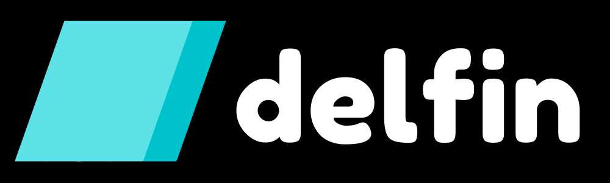

<p align="center">
<a href="https://github.com/heliconai/delfin"></a>
</p>

<p align="center">
<em>Delfin is a Multi-Task Annotation Tool with Active Learning Ambitions</em>
</p>

**Documentation**: WIP

---

# Delfin
As the need for annotated data is becoming apparent, Delfin aims to provide a unified application to manage and accelerate generation of labeled data.

Some of it's features include:
- **Multi-Task framework**: treat each dataset as an opportunity to extract multiple scopes of labels (e.g.
- **Built for Active Learning**: Delfin aims to provide a convenient interface for Machine Learning practitioners to embed active learning and semi-supervised learning approaches into their annotation workflow.
- **Extensible**: both the backend and frontend is built to be easily extensible with new annotation types and data modalities.
- **Easily Deployable**: dockerized and ready to deploy on your favourite cloud or on prem servers.

### Built On
- Python 3.7+
- Vue.js

### Initialize Environment (Outside of Docker)
```bash
export PYTHONPATH="${PYTHONPATH}:<path-to-repo>/delfin/backend/src/"
set -o allexport; source .env.local; set +o allexport;
```

### Deploy